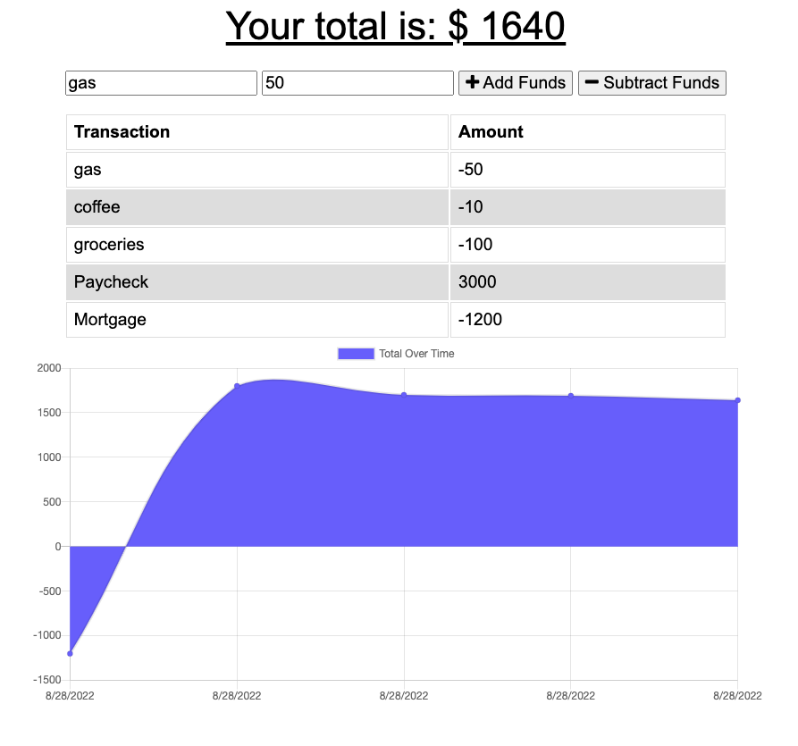

# Budget Tracker

## Description

The purpose of this project was to update an existing budget tracker application to allow for offline access and functionality. The user will be able to add expenses and deposits to their budget with or without a connection. If the user enters transactions offline, the total should be updated when they're brought back online.

## Table of Contents

- [Installation](#installation)
- [Usage](#usage)
- [License](#license)
- [Contributions](#contributions)
- [Testing](#testing)
- [Questions](#questions)

## Installation

Main installation requirements and dependencies are MongoDB, Mongoose, and Express.js. Contact me for further instructions!

## Usage

Here's a link to the deployed Heroku site: [Heroku app](https://warm-oasis-61117.herokuapp.com/)

## License

Copyright © 2022 [Caren Merz](https://github.com/cammeer).  
This project is [MIT](https://github.com/cammeer/next-progress-bar/blob/main/LICENSE) licensed.

## Contributions

I was the only contributor to this project. If you would like to contribute, see my email below.

## Tech

- JavaScript
- Node.js
- MongoDB database
- Mongoose ODM
- Express.js

## Testing

Testing was conducted via Chrome DevTools.

## Any Questions?

This project was created by me: [cammeer](https://github.com/cammeer)

Contact me with any questions at: [caren@merzhaus.org](caren@merzhaus.org)
